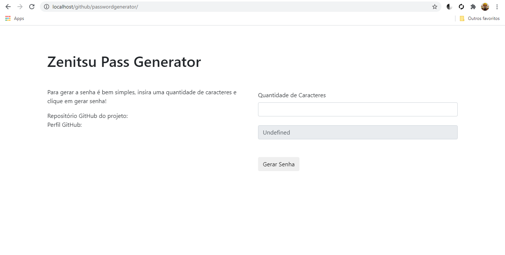

# Gerador de Senhas

Neste repositório, trago o código fonte de um gerador de senhas. O objetivo deste repositório é ajudar a comunidade a se desenvolver , além de manter afiada minhas habilidades desenvolvendo usando a linguagem PHP.

# Ferramentas presentes na versão atual:

  - Gerando senhas com tamanho dinâmico.
  - Gerando senhas com letras maiusculas.
  - Gerando senhas com numeros.
  - Gerando senhas com simbolos.
  
# Ideias para possiveis atualizações:

- Nenhuma ideia.

### Como instalar

Para usar estes arquivos, crie uma conta em um site de hospedagem como o 000webhost ou baixe um servidor em seu computador, como por exemplo o WampServer com suporte para PHP e arraste os arquivos para dentro e se divirta.

### Observação

Como o objetivo deste repositório é treinar minhas habilidades com php, não codifiquei o front-end do zero.
Link do código inicial:

https://bootsnipp.com/snippets/Q0k96